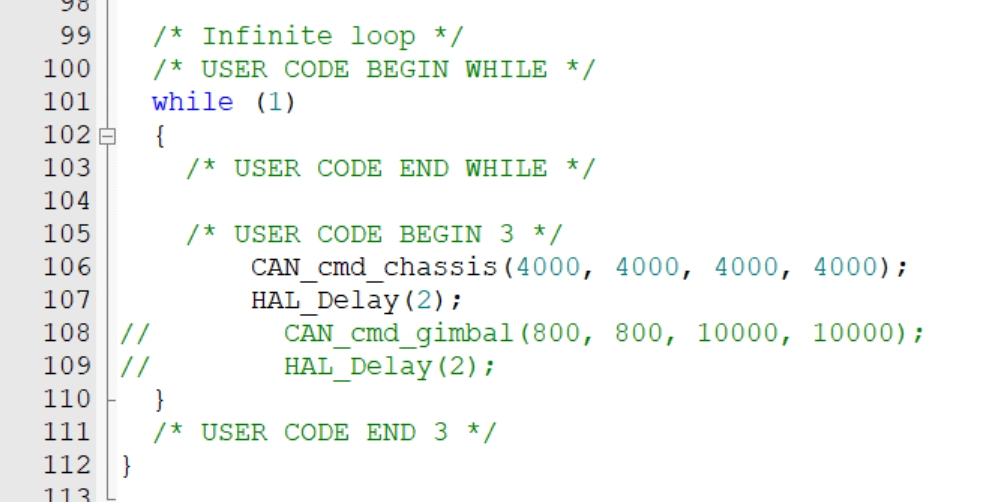
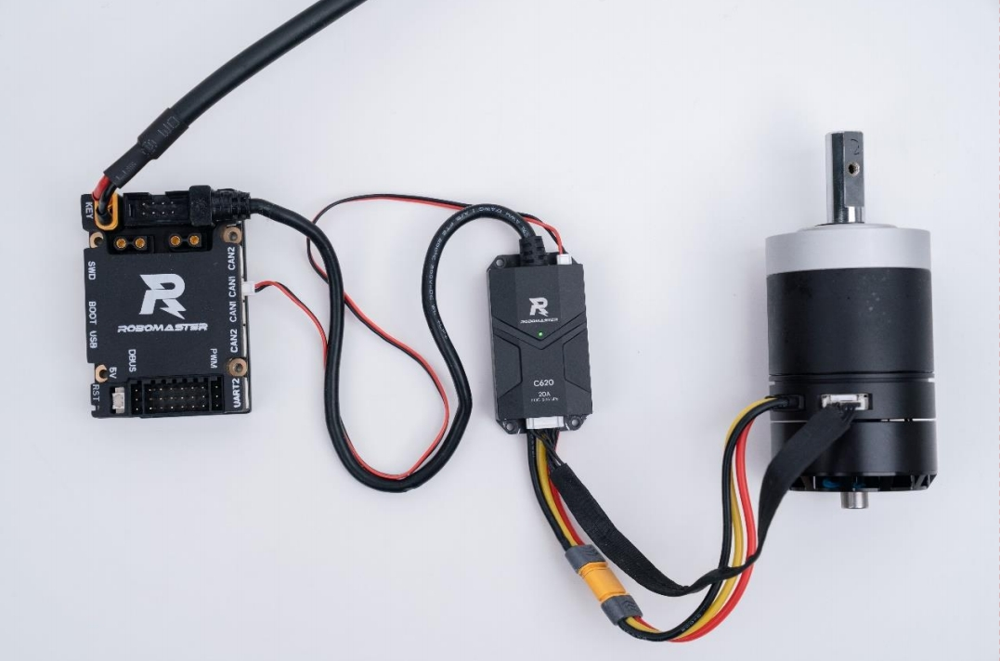

# C板驱动3508电机

- 文档同目录中上传了RMC板的开发教程，关于CAN通信的相关内容请从`189`页开始学习，想要直接在vsvode里查看pdf请先下载`vscode-pdf`，这里仅说明如何快速上手3508，让他转起来。
---
## 下载官方的例程

驱动3508最快速的方法就是跑通大疆RM官方的例程，这里是所有例程链接<https://github.com/RoboMaster/Development-Board-C-Examples>，请先下载到自己的电脑中。

## 打开官方的例程

下载完成后,根据以下路径打开`Development-Board-C-Examples-master` > `14.CAN` > `MDK-ARM` > `can.uvprojx`

找到一下代码并且批注掉`CAN_cmd_gimbal`，`HAL_Delay(2);`

## 相关函数解释
程序中提供了 `CAN_cmd_chassis` 函数和`CAN_cmd_gimbal` 函数,用于向底盘电机和云台电机发送CAN信号，控制电机运动，驱动3508只用到 `CAN_cmd_chassis` 所以注释掉其他函数。
- `CAN_cmd_chassis` 函数的输入为电机 1 到电机 4 的`驱动电流`期望值 motor1 到motor4，函数会将期望值拆分成高八位和第八位，放入 8Byte 的 CAN 的数据域中，然后添加 ID(CAN_CHASSIS_ALL_ID 0x200)，帧格式，数据长度等信息，形成一个完整的 CAN 数据帧，发送给各个电调。
- `CAN_cmd_gimbal` 函数的功能为向云台电机和发射机构电机发送控制信号，输入参数为`yaw` 轴电机，`pitch` 轴电机，发射机构电机的驱动电流期望值 `yaw`，`pitch`，`shoot`（rev 为保留值），函数会将期望值拆分成高八位和第八位，放入 8Byte 的 CAN 的数据域中，然后添加 ID（CAN_GIMBAL_ALL_ID 0x1FF），帧格式，数据长度等信息，形成一个完整的 CAN数据帧，发送给各个电调。

## 接线方法

按照图中方法连接c板与电机，C板供电使用实验室的24v电源。

开发板C型连接M3508电机
## 下载进C板

选择正确的link下载进C板中，官方例程给的默认的link并不是实验室常用的，请选择stlink或者daplink下载。

## 注意事项

1. 电机旋转时请清理周围的线材，避免缠绕。
2. 电机相应速度很快，参数不要给的非常大。参数区间在[-16384,16384]
3. 如果电机不转，请先检查电机ID是否正确，调整电调ID的方法如下：

    *C620电调硬件配置*
    -  电调连接好电源和电机
    -  用牙签类似的尖锐物体戳如图位置SET标识上方的小洞，内含一个按键
    - 短按一次进入配置CANID模式，此时灯灭
        - 每按一次灯会黄色闪烁一次
        - 短按n次则电调的ID为n，对应CAN报文ID为0x200+n，n在1到8之间
    - 长按一次进入自动校准模式
        - 此时电机会自动旋转一定角度，无需干预电机
        - 一定时间后灯变绿则正常
        - 如果一定时间之后灯变红闪烁，则设备损坏
