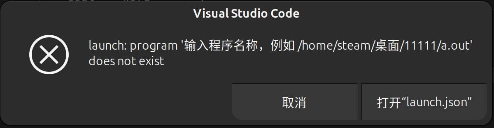

***ubuntu学习***
---
* 这是对于安装ubuntu后，想要进行串口调试的安装准备（一些准备是对于其他也通用的）
---
前提声明：笔者使用的是24.04（LTS）版本
# 安装edge浏览器
1. 首先，在安装ubuntu后第一件事，是从火狐浏览器上下载edge浏览器，因为火狐很不好用。
从火狐浏览器搜索edge去点击下载，
2. 然后点击下载.deb版本
3. 下载后进入下载文件夹，右键单击空白处选择在终端打开，执行`sudo dpkg -i app_name`这里的app_name换成你下载的.deb文件的文件全名（如 code_1.95.2-1730981514_amd64.deb 这是我的，你的不一定叫这个）然后enter运行，稍后问你(y/n)输入 y 之后等待安装完成，然后就能在所有应用中看到edge浏览器了
# 安装Visual Studio code
1. 打开安装好的edgee浏览器，搜索VScode，选择官网同样下载.deb文件
2. 回到你的下载目录，使用上面 <q>安装edge浏览器</q>同理方法安装。
## 配置VScode
网上有很多教程，不过和我的都有不适配的地方，我讲讲为的配置步骤
1. 配置内容：
* <h1 id="downlosd">一些拓展的下载<h1>
* <h2 id="C/C++">C/C++的环境(至少配置后可以正常写)<h2>

[*一些拓展的下载*](#download)
### 汉化下载
首先在安装好的VScode中点开扩展，即左侧正数第4个，搜索Chinese，下载小字描述为“中文(简体)”的扩展
### C/C++
搜索C++，下载名为C/C++ Extension Pack的拓展(他会下载好C++相关的一系列)等待下载好。
### Docker
搜索Docker，下载那个像鲸鱼图标的这个是沙箱容器，以后转移代码什么的能用到。
### 其他的可以选择安装的
我还安装了Python(笔者使用的24.04据教程说自带python3)，jupyter和Auto Import扩展，前两者不用解释，后者是辅助写代码自动补全的。
***注意***
ubuntu在使用过程中，如果你查看过其他教程或者之前有了解，那你可能会遇到，在编写代码的时候光标会莫名其妙得变成光柱无法输入，这是因为你安装了VIM扩展，他是一个文本编辑器，会导致输入过度保护，在扩展界面禁用就好了 。
>*C/C++的环境(至少配置后可以正常写)*
 正常来讲VScode并不是用来写C++的，他只是一个编辑器，不具有编译的能力，我们想用他进行正常的C++代码工作，需要下载编译器。
### 下载gcc，gun编译器工具，gbd调试器
这一步需要在终端界面进行，可以在VScode自带的也可以在ubuntu自带的进行。
在VScode中：快捷键"Ctrl+."或者单击上方栏目中终端字样->新建终端，然后首先看一看装没装过gcc，终端输入`gcc -v`如果出现如图应答则未安装过。则输入`sudo apt-get update`
首先更新包列表，输入`sudo apt-get install gcc`安装gcc，
然后输入`sudo apt-get install build-essential gdb`安装gun和gbd，
最后检查是否安装成功，分别输入`gcc --version`,`g++ --version`,`gdb --version`
### 调试配置运行
在VScode新建文件夹(会同步在主机相应位置创建)，新建Cpp文件(也就是C++)，编写一个简单的"Hello world"程序试运行。
***重要的来了***
* 如果你只想完成运行这一步骤，请按照<q>1.运行</q>步骤进行；
* 如果你还想完成断点调试，请在完成<q>2.调试</q>步骤后完成<q>1.运行</q>。
### 1. 运行
c++程序写好后先"Ctrl+s"保存，然后点击右上角运行
这时候会弹出这时候选择我图中第项，即g++生成和调试活动文件这一项，他会进行编译操作，随后你在左边工作区会找到
这样的文件(我的cpp文件起名为a.cpp，所以这个样子)，此时编译好了，可以在终端输入`./a`会执行编译好的cpp文件(c++基础知识:必须先编译再运行)这里的s“a”是你命名的文件名。
### 2. 编译
*一点基础知识
相对来讲，编译需要配置的就比较多了。首先你需要了解，VScode是一个集成式的开发环境，意思是说他可以实现对写入的C++代码执行一系列自动的操作(例如编译，运行，调试，这些操作原本是需要在命令行当中每次调试自己输入配置的)在这里就可以实现一次配置文件的书写，应用于整个工作空间，不用每次运行去配置。
这里我们想要实现简单调试，需要配置三个文件(这是普遍设置，独特需求自己问AI改)分别为:"tasks.json","launch.json","c_cpp_properties.json"名字记个大概就行。三者分别用于配置:构建任务、调试会话、C++在运行过程中的行为规范和调库。
* 配置
#### launch.json
1. 首先点击上方栏目的"运行->启动调试->搜索框中点击C++(GDB/LLDB)选项",他会提示你一个错误,点击打开“launch.json“(没反应就多试几次)打开后，你会看见初始配置，将如下代码覆盖原来代码 (不同安装路径需要更改的是"miDebuggerPath"，一般来讲都会默认安装在我代码中那目录) 
```JSON
        {
    "version": "0.2.0",
    "configurations": [
        {
            "name": "g++ - Build and debug active file",
            "type": "cppdbg",
            "request": "launch",
            "program": "${workspaceFolder}/program",
            "args": [],
            "stopAtEntry": false,
            "cwd": "${workspaceFolder}",
            "environment": [],
            "externalConsole": false,
            "MIMode": "gdb",
            "setupCommands": [
                {
                    "description": "Enable pretty-printing for gdb",
                    "text": "-enable-pretty-printing",
                    "ignoreFailures": true
                }
            ],
            "preLaunchTask": "build my program",
            "miDebuggerPath": "/usr/bin/gdb"
        }
    ]
}
```


#### tasks.json
1. 如果你手快，在完成上一步配置后再次点击调试，你会发现出现新的报错。不要急，这个报错你也看得懂这是说"构建我的项目这样的任务指令"未找到("Build my program")接下来进行tasks.json的构建。
点击调试，在弹出的框里面点击"配置任务"，选择"使用模板创建tasks.json文件"，选择Others，在生成的tasks.json文件中用如下代码覆盖原有代码
```JSON
{
    "version": "2.0.0",
    "tasks": [
        {
            "label": "build my program",
            "type": "shell",
            "command": "g++",
            "args": [
                "-g",
                "${workspaceFolder}/*.cpp",
                "-o",
                "${workspaceFolder}/program"
            ],
            "group": {
                "kind": "build",
                "isDefault": true
            }
        }
    ]
}
```


这里的代码作用是在当前工作区生成调试任务。这时候你进行调试的步骤，已可以正常调试，正常使用断点，不会报错。
#### c_cpp_properties.json
> 该文档里面的代码主要是用来实现一些高级功能，如重构，代码格式化，代码智能提示，错误提示等。
如果你未安装过名为"clangd"的扩展那么直接执行如下步骤:
1. 快捷键"Ctrl+Shift+p"打开或在左下角齿轮找到并打开命令面板，然后输入并选择"C/Cpp: Edit configurations..."， 这将直接生成一个默认的c_cpp_properties.json 文件，将如下代码覆盖原来代码(若有特殊需求，可以自行问AI调试参数，这并不难)
```JSON
{
    "configurations": [
        {
            "name": "Linux",
            "includePath": [
                "${workspaceFolder}/**",
                "/usr/include",
                "/usr/local/include"
            ],
            "defines": [
                "_DEBUG",
                "UNICODE",
                "_UNICODE"
            ],
            "compilerPath": "/usr/bin/g++",
            "cStandard": "c11",
            "cppStandard": "c++17",
            "intelliSenseMode": "gcc-x64"
        }
    ],
    "version": 4
}
```
2. *如果你之前不知道看什么教程而安装过clangd扩展，也不要急，那你和我一样。*
    我在尝试按照步骤输入代码创建json文件时候，未出现相应选项，经询问AI和检查得知，是我的clangd拓展和原本的这个功能冲突了，所以在安装扩展的同时自动关闭了带有的高级功能修改(也就是创建和编辑这个json文件的开关)。解决方法是禁用相关扩展，同时在setting.json的C_Cpp.intelliSenseEngineFallback项目中修改换成默认(未下载clangd应该不用动)

--- 
OK，那么到现在咱的VScode对于写C++文件就配置好了，当然如果你想写Python、Java或者其他语言的话，可以自行安装。
---
