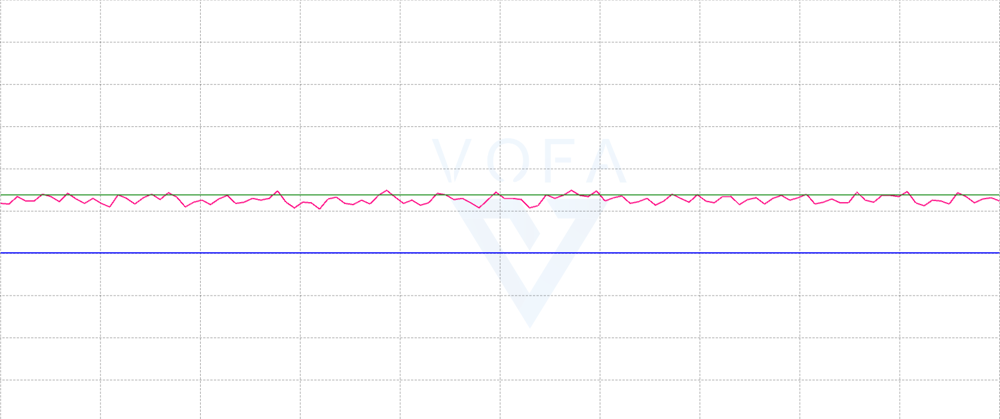

# vofa可视化PID调速，实现串口通信
 
 在用pid对3508进行调速时，可以用c板串口及串口调试助手，如vofa，实现可视化及pid动态调节

- 串口部分知识在C板教程的第八节：串口收发，教程提供了我们所需的串口收发函数。
---
### 官方例程下载

如何下载与打开官方代码已在3508驱动中提及，在此不再赘述

---
### 串口收发代码
```C
	while()
    {
        
    HAL_Delay(2);
	sprintf(str, "%d", motor_chassis[1].speed_rpm);//实际速度
	sprintf(expe, "%d", Expectation);//预期速度
    CAN_cmd_chassis(out_put, out_put, out_put, out_put);
	HAL_UART_Transmit(&huart6,(uint8_t *)str,strlen(str),1);
	HAL_UART_Transmit(&huart6,",",1,1);
	HAL_UART_Transmit(&huart6,(uint8_t *)expe,strlen(expe),1);
	HAL_UART_Transmit(&huart6,",4\r\n",4,1);
    
    }

```
## 相关函数解释
- sprintf()函数将一个整数值motor_chassis[1].speed_rpm格式化为字符串，并将这个字符串存储在 str 中，并将一个整数值Expectation喜欢换位字符串存储在expe中。
- 例程中提供的HAL_UART_Transmit()是一个串口发送函数,用于通过UART发送字符串。这几行代码实现在vofa上电机实时速度和期望值的可视化，方便调参。
---

### 使用DMA来进行 UART 的发送和接收操作
- 使用DMA可以提高效率，进行数据的连续处理
- 相关代码
``` C
void HAL_UART_RxCpltCallback(UART_HandleTypeDef *huart){
            HAL_UART_Transmit_DMA(&huart6,(uint8_t *)receivedata,4);
			HAL_UART_Receive_DMA(&huart6,(uint8_t *)receivedata,4);
}
//DMA接收中断回调函数
void HAL_UARTEx_RxEventCallback(UART_HandleTypeDef *huart, uint16_t Size){
  //判断触发中断的是哪个uart
  if(huart == &huart6){
      if (receivedata[0] == '@') {
        // 临时缓冲区存储分割后的 PID 参数
        float temp_Kp, temp_Ki, temp_Kd;

        // 使用 sscanf 解析接收到的数据，假设数据格式为 "@Kp@Ki@Kd@"
        if (sscanf(receivedata, "@%f@%f@%f@", &temp_Kp, &temp_Ki, &temp_Kd) == 3) {
            // 更新 PID 参数
            pid.Kp = temp_Kp;
            pid.Ki = temp_Ki;
            pid.Kd = temp_Kd;

            // 发送确认消息
            char response[50];
            sprintf(response, "PID updated: Kp=%.4f, Ki=%.5f, Kd=%.3f\r\n", pid.Kp, pid.Ki, pid.Kd);
            HAL_UART_Transmit_DMA(&huart6, (uint8_t *)response, strlen(response));
        } else {
            // 发送解析失败的错误信息
            char error_response[] = "Error: Invalid PID format\r\n";
            HAL_UART_Transmit_DMA(&huart6, (uint8_t *)error_response, strlen(error_response));
        }
    } else {
        // 尝试将接收数据转换为目标速度
        int temp_expectation = atoi(receivedata);

        // 验证转换结果是否合理
        if (temp_expectation >= 0 && temp_expectation <= 1000) { // 假设目标速度必须在 0 到 1000 之间
            Expectation = temp_expectation;
        } else {
            // 发送错误信息
            char error_response[] = "Error: Invalid speed input\r\n";
            HAL_UART_Transmit_DMA(&huart6, (uint8_t *)error_response, strlen(error_response));
        }
    }


    HAL_UART_Transmit_DMA(&huart6,(uint8_t *)receivedata,Size);
    HAL_UARTEx_ReceiveToIdle_DMA(&huart6,(uint8_t *)receivedata,MAX_RECEIVE_LENTH);
  }
}

```
- 此代码实现的效果：在vofa中直接更改pid参数而不需要更改代码
- 注：使用本代码时，vofa开始无波动且电机不转，这是因为本代码设置的期望值为1。在信息栏发送你想要的电流值，电机开始转动，如图
- pid调参格式如下，第一个@后为p参数，以此类推，发送后即可调参

---
 
## vofa使用教程
### vofa安装 
- 官网下载，免费软件
- 参数，模式设置
vofa有三种收发协议，FireWater,RawData,JustFloat,其使用条件及格式在可直接查看官网提供的参考

  
  点击右侧问号，进入官网查看。
   
   - 正确选择端口，串口连接后查看设备管理器，找到CH340对应的端口号，若没有出现，则需要下载CH340驱动。
   - 波特率要与在CubeMX中设置的波特率匹配
---   
## PID调速
- PID速度环计算公式及原理可自行查阅资料，在此只提供代码实现

```C
typedef struct {
    float Kp;    // 比例常数
    float Ki;    // 积分常数
    float Kd;    // 微分常数
    float prev_error;  //上上一次误差
    float last_error;  // 上一次误差
    float error;       //当前误差
    float dErrI;    // 积分
    float dErrD;  //微分
    float dErrP;  //比例
    float doutput;    
    float output;     //电机输出值
} PID_Controller;
PID_Controller pid = {9, 0, 0,0,0,0,0,0,0,0,0}; // 初始PID参数

```
- 自定义一个结构体，存放及初始化PID中的变量


